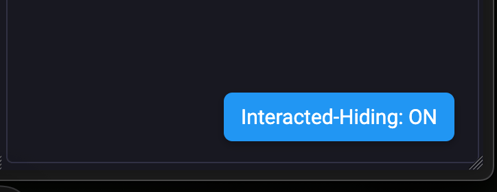
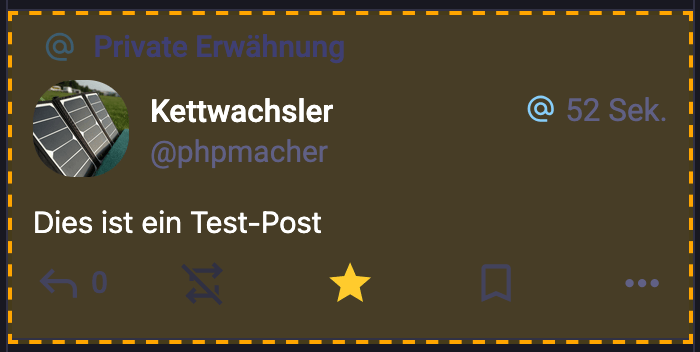

# Mastodon Hide Interacted Posts (Toggleable)

This userscript hides all Mastodon posts that you've **already liked or boosted**, to help reduce visual clutter in your timeline.\
The behavior is **toggleable via a floating button** in the UI, and the setting is remembered across sessions.
If the feature is switched to ON, the posts are hidden after 4,5s.

---

## 🧹 Features

- Automatically hides posts you've liked ⭐ or boosted ♻️
- Adds a small floating toggle in the bottom-right corner
- Persists your ON/OFF setting using localStorage
- Debug-friendly styling before hiding (orange dashed border)
- Works on `sueden.social`, `mastodon.social`, and any `*.social` instance

---

## 📸 Screenshots

Toggle the feature on and off:


Example of a marked post:


---

## ⚙️ How It Works

The script observes all `.status` elements and checks whether:

- The post was **liked** (button with `.star-icon.active`)
- The post was **boosted** (button with `title` or `aria-label` like *"Beitrag nicht mehr teilen"* or *"Unboost"*)

If either is true, the surrounding `<article>` element is marked and eventually hidden.\
It uses `MutationObserver` to work with infinite scrolling.

---

## 👡️ Toggle Behavior

A small button appears in the bottom-right corner:

| State       | Appearance                            |
| ----------- | ------------------------------------- |
| ON (active) | Blue button: `Interacted-Hiding: ON`  |
| OFF         | Gray button: `Interacted-Hiding: OFF` |

Click the button to toggle the hiding logic.

---

## ⏱️ Delay Before Hiding

To help with debugging and testing, there's a short delay (default: 4.5 seconds) before a post gets hidden.\
This gives you time to verify that the detection worked.

```ts
const HIDE_DELAY_MS = 4500;
```

---

## 💻 Installation

Install via [Tampermonkey](https://www.tampermonkey.net/) or a compatible userscript manager.

- [Install this script from GitHub](https://github.com/phpmacher/mastodon-hide-interacted-posts/raw/main/mastodon-hide-interacted-posts.user.js)

---

## 🛠️ Customization

You can easily adjust the `HIDE_DELAY_MS` constant in the script if you prefer instant hiding.

```ts
const HIDE_DELAY_MS = 4500;
```

---

## 📜 License

MIT – free to use, modify, share. – see the [LICENSE](LICENSE) file for details.

---

## 😋 Author

[@phpmacher](https://sueden.social/@phpmacher)

---

## Contributions

Please feel free to submit issues or pull requests if you'd like to improve the script.